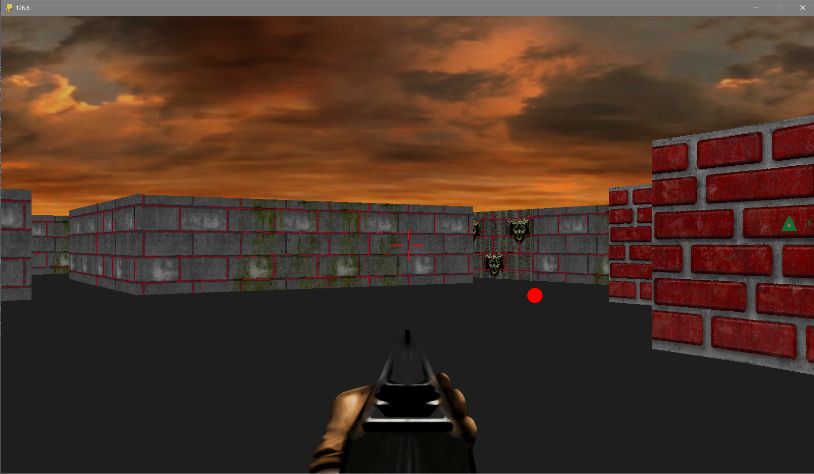

# 🕹️ Wolfenstein-Style 3D Raycasting Game Engine

A custom, high-performance pseudo-3D game engine built from scratch in Python using **Pygame**. Bypassing modern GPU polygon pipelines, this project implements a software-based **Raycasting algorithm (Digital Differential Analysis - DDA)** to render a fully navigable three-dimensional environment out of a flat 2D matrix array, heavily inspired by John Carmack’s legendary work on *Wolfenstein 3D* (1992).



---

## 🚀 Core Engine Features & Engineering Highlights

This repository showcases the practical application of game physics, trigonometry, and core computer graphics principles:

* **Real-Time DDA Raycasting Loop:** Dynamically projects hundreds of lines of sight (rays) matching the player's Field of View (FOV). It mathematically tests grid intersections across horizontal and vertical axes to locate walls instantly without heavy collision overhead.
* **Texture Mapping & Vertical Slicing:** Extracts individual pixel columns from textures based on precise wall intersection points (`offset`), scaling them inversely to depth to create a genuine illusion of perspective.
* **Painter's Algorithm (Z-Sorting Pipeline):** Combines, sorts, and renders walls, static objects, and dynamic entities sequentially based on their distance from the camera viewport to prevent overlapping visual bugs.
* **Fishbowl Effect Correction:** Eliminates perspective distortion caused by the radial camera lens by normalizing raw ray distances against the player's view vector using cosine scaling.
* **Stateful Animated NPCs:** Includes a complete state machine for enemies (Soldiers) handling dynamic path-of-sight raycasting, pain registration, and fluid sprite animations.

---

## 📐 The Math Under the Hood: How It Works

The engine translates the 2D world map into 3D projection on every frame through the following sequence:

### 1. Vector Projection & Intersection
For each vertical column on the screen, a ray is cast at an angle ($\theta$). The algorithm calculates grid crossings dynamically:
$$\text{depth\_hor} = \frac{y_{\text{hor}} - o_y}{\sin(\theta)}$$
$$\text{depth\_vert} = \frac{x_{\text{vert}} - o_x}{\cos(\theta)}$$

### 2. Lens Distortion Correction
To keep flat walls looking straight instead of curved, the raw depth is multiplied by the cosine of the relative angle:
$$\text{Corrected Depth} = \text{Raw Depth} \times \cos(\text{Player Angle} - \text{Ray Angle})$$

### 3. Screen Height Projection
The pixel height of the wall slice on the screen is inversely proportional to its corrected distance:
$$\text{Projected Height} = \frac{\text{Screen Distance}}{\text{Corrected Depth}}$$

---

## 💻 Tech Stack & Architectural Matrix

| Module | Technical Function / Responsibility |
| :--- | :--- |
| **`main.py`** | Application lifecycle driver, game clock manager (`delta_time`), and core game loop execution. |
| **`raycasting.py`** | The mathematical heart. Calculates geometric ray-intersections, distances, offsets, and texture slicing. |
| **`object_render.py`** | Handles background blitting (sky scrolling based on mouse movement), floor rendering, and Z-buffer sorting. |
| **`player.py`** | Manages vector-based WASD movement, wall-bounding box collisions, and mouse look/sensitivity. |
| **`npc.py`** | Enemy AI engine containing individual field-of-sight raycasts to detect and interact with the player. |
| **`sound.py`** | Multi-channel audio mixer handling simultaneous environment themes and action-triggered audio cues. |

---

## 🛠️ Installation & Execution

### Prerequisites
Make sure you have Python 3.x and Pygame installed on your machine:
```bash
pip install pygame
